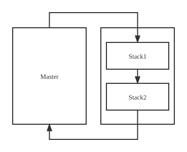

我的 dwm 构建
============================

从[theniceboy的dwm配置](https://github.com/theniceboy/dwm) fork 而来, 同时也 fork 了[脚本](https://github.com/theniceboy/scripts), 对键位和一些设置做了一些修改

dwm 是一个非常快速, 小巧并使用动态管理窗口的窗口管理器

要求
------------
构建 dwm 前, 你需要有 `Xlib` 头文件

安装
------------
编辑 `config.mk` 来匹配你的本地设置 (dwm 将默认安装在 /usr/local)

之后通过以下命令安装 dwm (必须使用 root 用户):

    make clean install

应用的自定义补丁
---------------
- [dwm-alpha-20180613-b69c870.diff](https://dwm.suckless.org/patches/alpha/)
- [dwm-autostart-20161205-bb3bd6f.diff](https://dwm.suckless.org/patches/autostart/)
- [dwm-awesomebar-20191003-80e2a76.diff](https://dwm.suckless.org/patches/awesomebar/)
- [dwm-fullscreen-6.2.diff](https://dwm.suckless.org/patches/fullscreen/)
- [dwm-hide-and-restore.diff](https://github.com/theniceboy/dwm-hide-and-restore-win.diff)
- [dwm-hide_vacant_tags-6.2.diff](https://dwm.suckless.org/patches/hide_vacant_tags/)
- [dwm-noborder-6.2.diff](https://dwm.suckless.org/patches/noborder/)
- [dwm-pertag-20170513-ceac8c9.diff](https://dwm.suckless.org/patches/pertag/)
- [dwm-r1522-viewontag.diff](https://dwm.suckless.org/patches/viewontag/)
- [dwm-rotatestack-20161021-ab9571b.diff](https://dwm.suckless.org/patches/rotatestack/)
- [dwm-scratchpad-6.2.diff](https://dwm.suckless.org/patches/scratchpad/)
- [dwm-vanitygaps-20190508-6.2.diff](https://dwm.suckless.org/patches/vanitygaps/)

运行 dwm
-----------
将以下行添加到 .xinitrc 中来通过 `startx` 启动 dwm:

    exec dwm

如果你需要使用多显示器启动 dwm, 你需要设置屏幕变量, 以下是一个例子:

    DISPLAY=foo.bar:1 exec dwm

(这样将会启动 dwm 并显示在显示器一上)

如果你想自定义你的状态栏, 你可以在 .xinitrc 添加行, 以下是一个例子:

    while xsetroot -name "`date` `uptime | sed 's/.*,//'`"
    do
    	sleep 1
    done &
    exec dwm

键位设置
------------

在此之前希望你能够知道dwm 中 Master 与 Stack 的概念, dwm 默认将窗口分为 Master 区域(左)与 Stack 区域(右)

默认布局下 Master 区域永远占据固定大小的屏幕空间, 新打开的应用窗口永远占据 Master 区域, 被新的 Master 区域挤下去的应用窗口会移动到Stack区域的最上方

### 键位绑定应用启动

使用 `Mod+d` 打开 dmenu, dmenucmd 在 dmw 默认配置中已经预先定义好

	static char dmenumon[2]            = "0"; /* component of dmenucmd, manipulated in spawn() */
	static const char *dmenucmd[]      = { "dmenu_run", "-m", dmenumon, "-fn", dmenufont, "-nb", col_gray1, "-nf", col_gray3, "-sb", col_cyan, "-sf", col_gray4, NULL };

	{ MODKEY,              XK_d,                    spawn,          {.v = dmenucmd } }

使用 `Mod+p`打开 rofi 

	static const char *rofilanchcmd[] = { "rofi", "-show", "drun", NULL };
	{ MODKEY,              XK_p,                    spawn,			{.v = rofilanchcmd} }

### 聚焦与移动

因为 dwm 并不是平铺式窗口管理器, 因此在应用窗口之间聚焦并不是像 i3 那样通过上下左右自由的控制聚焦与移动, 在 dwm 中这个操作更像是在操作一个`环`, 在这个环中只有前进与后退

应用窗口聚焦的移动就是光标在`环`中移动, 应用窗口的移动就是转动这个环

应用窗口聚焦移动键位绑定

	{ MODKEY,              XK_j,                    focusstack,     {.i = +1 } }
	{ MODKEY,              XK_k,                    focusstack,     {.i = -1 } }

应用窗口移动键位绑定

	{ MODKEY|ShiftMask,    XK_j,                    rotatestack,    {.i = +1 } }
	{ MODKEY|ShiftMask,    XK_k,                    rotatestack,    {.i = -1 } }

togging窗口切换

	{ MODKEY,              XK_h,                    viewtoleft,     {0} }
	{ MODKEY,              XK_l,                    viewtoright,    {0} }

将应用窗口移动到别的tagging窗口

	{ MODKEY|ShiftMask,    XK_h,                    tagtoleft,      {0} }
	{ MODKEY|ShiftMask,    XK_l,                    tagtoright,     {0} }

调整 Master 区域与 Stack 区域大小

	{ MODKEY,              XK_u,                    setmfact,       {.f = -0.05} }
	{ MODKEY,              XK_i,                    setmfact,       {.f = +0.05} }

将 Stack 区域顶部应用窗口移动到 Master 区域底部, 将 Master 区域底部窗口移动到 Stack 区域顶部

	{ MODKEY|ShiftMask,    XK_u,                    incnmaster,     {.i = +1 } }
	{ MODKEY|ShiftMask,    XK_i,                    incnmaster,     {.i = -1 } }

